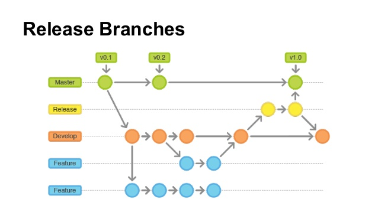

# GIT
Es un sistema de control de versiones distribuido como mercurial o bazzar | no es un sistema de compias de seguridad.


# Local

### configuración
usar `--global` o `--system` o `--local` según se necesite. 

listar configuracion

    git config --list --environment

modificar configuración

    git config --environment user.name "new value"

guardar cambios de configuración local

    git commit -a

### iniciar repositorio
    git init .

### agregar cambios al staging
```
git add directrory 
```

```
git add *.extensionFile
```

```
git add . 
```

### descartar cambios que no se han agregado al staging
se usa `-n` para probrar que se eliminaría
se usa `-f` para eliminar
se usa `-i` para eliminar de forma interactiva

    git clear -n

### comprometer cambios
    git commit -am "your message"

### Renombrar rama actual 
    git branch -M newNameBranch

### ver cambios en mi repositorio con respecto al remoto
    git diff

### agregar etiquetas
usar `-a` para etiquetas complejas
usar `-m` para agregar comentario
si no se especifica el código de confirmación se aplica al último commit

    git tag tagName(ej : v1.0) condeCommitConfimation

### subir etiqueta al remoto
    git push origin tagName

### cambiar a rama o etiqueta
    git checkout tagOrBranchName

### revertir cambios a nivel de commit
se crea un nuevo commit con los cambios de un commit anterior, obviando los que estan en medio.
usat `-n` para no crear el commit automáticamente

    git revert codeCommitConfirmation 

 


### regresar a un commit quitando del historial los de enmedio
se puede usar `commitCode` o `HEAD~numReversePosition` para indicar a que comit resetear
posterior al reset se debe hacer push com `-f` para forzar el atraso en commits

con `--soft` se quita el historial de los commits pero no se eliminan archivos

    git reset --soft HEAD~numReversePosition

con `--mixed` es el por defecto trabaja en el staging y saca del área del stagin los cambios

    git reset --mixed

con `--hard` se quita el historial de los commits y se eliminan archivos

    git reset --hard HEAD~numReversePosition


### eliminar archivo de git
    git rm fileName

### indicar el commit en que se rompió el proyecto
    git bisect bad  commtCode

e indicar hasta que commit funcionaba

    git bisect good commitCode

### ver quién modifica qué
    git blame fileName


# Ramas

### listar las ramas
    git branch

### crear rama 
    git branch nameNewBranch

crearla desde un commit específico

    git branch nameNewBranch codeOldCommit

### eliminar rama

    git branch -d nameBranch

### moverse entre ramas
usar `-b` en caso de que no exista la rama para crearla
usar commitCode para moverse a un commit en concreto

    git checkout nameBranch

### traer cambios de una rama a la actual
si no se han presentado cambios en la rama actual se hace merge por `Fast-forward`<br/>
si se han hecho cambios en la rama actual se crea un nuevo commit en la rama actual con los cambios

    git merge nameOtherBranch

si se quieren traer los commit de una forma plana como si nunca hubiese existido la otra rama(recomendado sólo en local)

    git rebase nameOtherBranch

### guardar algo para luego continuarlo sin hacer commit
    git stash save "name"

para recuperarlo 

    git stash apply
    git stash clear

para recuperar y limpiar

    git stash pop

para listar los stash 

    git stash list


### fucionar commits concretos

    git cherry-pick commitCode

para fucionar un intervalo cerrado

    git cherry-pick commitCode^..commitCode

para fucionar un intervalo abierto

    git cherry-pick commitCode..commitCode

### ver commits de una rama
usar `'*'` para ver todos los commits

    git log --branches='nameRama'

# Remoto

### Agregar repositorio remoto
    git remote add origin http://github.com/yourUrl

### Cambiar URL de repositorio remoto
    git remote set-url origin http://github.com/newUrl

### Empujar por primera vez una rama al repositorio remoto
`-u` se usa para indicar que ésta será la rama por defecto, de tal modo que posteriormente pueda hacerce 
únicamente `git push` para actualizar esta rama.

    git push -u origin yourNameBranch


### Traer cambios del repositorio remoto 
    git pull

### saber los cambios sin traerlos
se obtienen los metadatos más no trae los cambios

    git fetch

# .gitignore File

comentarios

    # your comments

carpetas

    folderName/forlderName

archivos

    folder/fileName
    fileName

archivos de cierta extensión

    *.extension

un archivo con esa extension que si hará push

    !fileName.extension


# git flow




### iniciar git flow
    git flow init 

## feature branch
todas las funciones nuevas deben desarrollarse en una rama de este tipo

### desarrollar nuevas funcionalidades
    git flow feature start feature_name

### desarrollo de la funcionalidad
elimina la rama de feature

    git flow feature finish feature_name

## release branch
es una rama de pre producción, se usa para sulucionar posibles bugs antes de producción

### pasar de develop a release 
    git flow release start 0.1

### finalizar la rama release
hace un merge a `main`/production y se debe poner etiqueta

    git flow release finish '0.1'

## hotfix branch
se usa para sulucionar bugs directamente de la rama de producción/`main`

### iniciar rama hotfix
    git flow hotfix start hotfix_1


### finalizar la rama hotfix
se fuciona con la rama `main` creando la etiqueta y se fuciona con la rama develop

    git flow hottfix finish hotfix_1