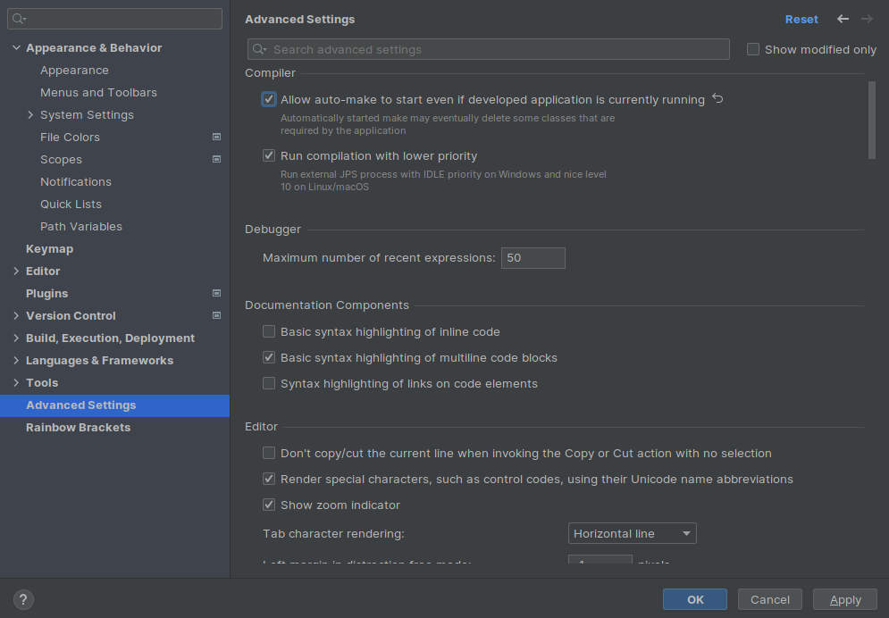
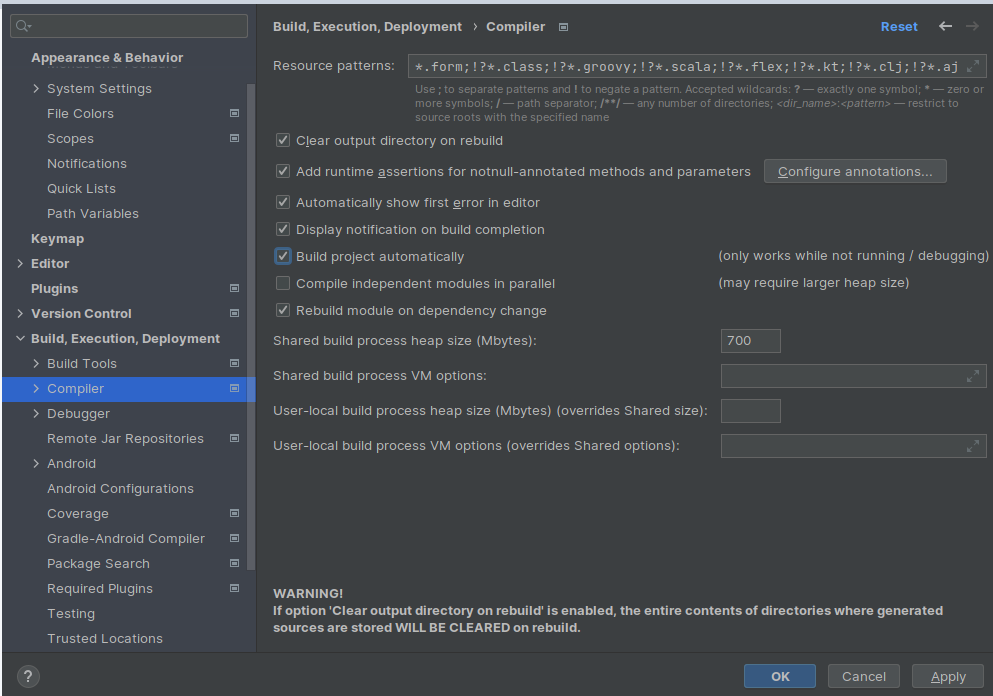

# Spring

# Beans
se utilizan para la inyección de dependencias, es decir que spring crea los objetos y nos los entrega mediante un patrón singlenton.

## estructura de proyecto maven
```text
├── pom.xml
├── src
│   ├── main
│   │   ├── java
│   │   │   └── com
│   │   │       └── example
│   │   │           ├── Main.java
│   │   └── resources
│   │       └── beans.xml
│   └── test
│       └── java

```

## pom.xml
se agrega la dependencia [spring contextet](https://mvnrepository.com/artifact/org.springframework/spring-context/5.3.23) de [maven repository.](https://mvnrepository.com/) 

```xml
<!-- https://mvnrepository.com/artifact/org.springframework/spring-context -->
<dependency>
    <groupId>org.springframework</groupId>
    <artifactId>spring-context</artifactId>
    <version>5.3.23</version>
</dependency>
```

## src/main/java/resources/beans.xml
en éste archivo se pondrá la [plantilla](https://docs.spring.io/spring-framework/docs/4.2.x/spring-framework-reference/html/xsd-configuration.html) para alojar los beans.

```xml
<?xml version="1.0" encoding="UTF-8"?>
<beans xmlns="http://www.springframework.org/schema/beans"
    xmlns:xsi="http://www.w3.org/2001/XMLSchema-instance"
    xsi:schemaLocation="
        http://www.springframework.org/schema/beans http://www.springframework.org/schema/beans/spring-beans.xsd">

    <!-- bean definitions here -->

</beans>
```

## definición de un bean para la inyección de dependencias.
`id` indica el nombre con el que nos referiremos al bean y `class` le indica al bean el objeto que creará.
```xml
<bean id="User" class="org.example.User" />
```
en caso de no querer que se entreguen los objetos mediante el patron singlenton se agrega la propiedad `scope="prototype"`
```xml
<bean id="UserButDiffRef" class="org.example.User" scope="prototype" />
```
si la el consructor de la clase resibe parámetros. <br/>
se usa `ref` en lugar de `value` para pasar como valor otro bean.
```xml
<bean id="UserCtrl" class="org.example.UserCtrl">
        <constructor-arg name="user" ref="user"></constructor-arg>
        <constructor-arg name="name" value="Controller 3000"></constructor-arg>
</bean>
```
## beans scanner
Escanea automáticamente las clases a las que se les agregue el decorador `@Component` <br/>
se agrega una plantilla diferente en `src/main/java/resources/beans.xml` [que contenga context](https://www.baeldung.com/spring-application-context).


```xml
<?xml version="1.0" encoding="UTF-8"?>
<beans xmlns="http://www.springframework.org/schema/beans"
  xmlns:xsi="http://www.w3.org/2001/XMLSchema-instance"
  xmlns:context="http://www.springframework.org/schema/context"
  xsi:schemaLocation="http://www.springframework.org/schema/beans
    http://www.springframework.org/schema/beans/spring-beans.xsd
    http://www.springframework.org/schema/context
    http://www.springframework.org/schema/context/spring-context.xsd">
  
  <context:component-scan base-package="com.example"/>

</beans>
```

## uso en main
```java
package org.example;

import org.springframework.context.ApplicationContext;
import org.springframework.context.support.ClassPathXmlApplicationContext;

public class Main {

    public static void main(String[] args) {
        ApplicationContext context = new ClassPathXmlApplicationContext("beans.xml");
        // create normal object
        User oUser = new User();

        // ask / request object to spring
        User oJuan = (User)context.getBean("user");
        User oJuan2 = (User)context.getBean("user");

        System.out.println(oJuan == oLuisa ? "they are equals" : "they aren't equals");

        // create object with dependencies -> bean within bean
        UserCtrl ctrl = (UserCtrl) context.getBean("userCtrl");
        System.out.println("name ctrl: "+ctrl.getName());

        //create child class
        User student = (Student)context.getBean("student");

    }
}
```

# Spring Boot
Se genera el proyecto dese [SpringInitialzr](https://start.spring.io/) <br/>
se agregan las dependncia necesarias.

## recomedadas 

* `Spring Data JPA` para la intefración con BD
* `para la BD` (se usa en proyectos de peueba)
* `String Web` para montar la aplicación rest
* `Spring Boot DevTools` una especie de nodemon(en js)

<hr/>

`NOTA` si se presentan problemas en el pom.xml `<buil/>` agregamos la version en `<plugin/>` `<version>2.7.5</version>`
<hr/>

## configuración de `Spring boot Devtools`
configurar auto guardar en IJ



configurar auto crear para cada proyecto spring boot



## anotaciones / decoradores 

## a clases
para indicar que los objetos de una clase se almacenarán en base de datos

	@Entity

para indicar el nombre de la tabla

	@Table(name = "books_tbl")

para servicios rest con JSON

	@RestController

## a interfaces 
para indicar que será un repositorio 

	@Repository

además se extiende de JpaRepository

	extends JpaRepository<Class, ClassIsd>

## métodos
para generar endPoint 

	 @GetMapping("/path")
	
	 @PostMapping("/path")

## a atributos
para indicar que un atributo será id

	@Id

para indicar la estrategia de generación del id

	@GeneratedValue(strategy = GenerationType.IDENTITY)

## parámetros 
para obtner los valores de petiiones(@GetMapping("/hello/{id}"))

	@PathVariable Long id

para obtener un body

	@RequestBody Class instance

para obtener cabeceras

    @RequestHeader HttpHeaders headers


# Responses
no encontrado 

    ResponseEntity.notfound().build();

encontrado 

    ResponseEntity.ok(istanceEntity);

# Documentación con swagger | esta dependencia me lanza un error para spirng `2.7.5`, se debe estar en la versión `2.5.5` para que funcione con normalidad
agregamos la dependencia [SpringFox Boot Starter](https://mvnrepository.com/artifact/io.springfox/springfox-boot-starter/3.0.0)
```xml
<!-- https://mvnrepository.com/artifact/io.springfox/springfox-boot-starter -->
<dependency>
    <groupId>io.springfox</groupId>
    <artifactId>springfox-boot-starter</artifactId>
    <version>3.0.0</version>
</dependency>

```

creamos el archivo de configuración Swagger `com/example/package/config/SwaggerConfig.java`

```java
import org.springframework.context.annotation.Bean;
import org.springframework.context.annotation.Configuration;

import springfox.documentation.builders.PathSelectors;
import springfox.documentation.builders.RequestHandlerSelectors;
import springfox.documentation.service.ApiInfo;
import springfox.documentation.service.Contact;
import springfox.documentation.spi.DocumentationType;
import springfox.documentation.spring.web.plugins.Docket;

import java.util.Collections;

/**
 * Configuración Swagger para la generación de documentación de la API REST
 *
 * HTML: http://localhost:8081/swagger-ui/
 * JSON: http://localhost:8081/v2/api-docs
 */
@Configuration
public class SwaggerConfig {

    @Bean
    public Docket api(){

        return new Docket(DocumentationType.SWAGGER_2)
                .apiInfo(apiDetails())
                .select()
                .apis(RequestHandlerSelectors.any())
                .paths(PathSelectors.any())
                .build();
    }

    private ApiInfo apiDetails(){
        return new ApiInfo("Spring Boot Book API REST",
                "Library Api rest docs",
                "1.0",
                "http://www.google.com",
                new Contact("Alan", "http://www.google.com", "alan@example.com"),
                "MIT",
                "http://www.google.com",
                Collections.emptyList());
    }

}
```

podrémos encontrar la documentación en `localhost:5000/swagger-ui/`

para ignorar un endpoint en la documentación

    @ApiIgnore

para agregar un comentario adicional al endpoint

    @ApiOperation("use this endpoint for update uno boook")


# Testing | Junit

se puede generar desde el método, click derecho > generate > test

a cada método tesster se le agrega el decorador 

    @Test


comprobar acierto booleano

    assertTrue(expresion);

comprobar igualdad

    assertEquals(value1, value2);

## testear controlador

se agrega el decorador springBootTest a la clase

    @SpringBootTest(webEnviroment = SpringBootTest.WebEnviroment.RANDOM_PORT)

configurar los test controller

```java
private TestRestTemplate testRestTemplate;

    @Autowired
    private RestTemplateBuilder restTemplateBuilder;

    @LocalServerPort
    private int port;

    @BeforeEach
    void setUp() {
        restTemplateBuilder = restTemplateBuilder.rootUri("http://localhost:" + port);
        testRestTemplate = new TestRestTemplate(restTemplateBuilder);
    }
```    

un ejemplo de test controller

```java
@Test
void findAll() {
    ResponseEntity<Book[]> response  =
        testRestTemplate.getForEntity("/api/books", Book[].class);

    assertEquals(HttpStatus.OK, response.getStatusCode());
    assertEquals(200, response.getStatusCodeValue());

    List<Book> books = Arrays.asList(response.getBody());
    System.out.println(books.size());

}

@Test
void findOneById() {

    ResponseEntity<Book> response  =
            testRestTemplate.getForEntity("/api/books/1", Book.class);

    assertEquals(HttpStatus.NOT_FOUND, response.getStatusCode());
}

@Test
void create() {

    HttpHeaders headers = new HttpHeaders();    
    headers.setContentType(MediaType.APPLICATION_JSON);
    headers.setAccept(Arrays.asList(MediaType.APPLICATION_JSON));

    String json = """
            {
                "title": "Libro creado desde Spring Test",
                "author": "Yuval Noah",
                "pages": 650,
                "price": 19.99,
                "releaseDate": "2019-12-01",
                "online": false
            }
            """;

    HttpEntity<String> request = new HttpEntity<>(json,headers);

    ResponseEntity<Book> response = testRestTemplate.exchange("/api/books", HttpMethod.POST, request, Book.class);

    Book result = response.getBody();

    assertEquals(1L, result.getId());
    assertEquals("Libro creado desde Spring Test", result.getTitle());

}
```

# Spring security

se añase la dependencia `Spring Security` al crear el proyecto.

```xml
<dependency>
    <groupId>org.springframework.boot</groupId>
    <artifactId>spring-boot-starter-security</artifactId>
</dependency>

<dependency>
    <groupId>org.springframework.security</groupId>
    <artifactId>spring-security-test</artifactId>
    <scope>test</scope>
</dependency>
```

para configurar usuario y contraseña en el archivo `system.properties`

    spring.security.user.name= luis
    spring.security.user.password=12345    

se crea la clase `WebSecurityConfig` a nivel del main

```java
package com.example.yourPackage;

import org.springframework.context.annotation.Bean;
import org.springframework.context.annotation.Configuration;
import org.springframework.http.HttpMethod;
import org.springframework.security.config.annotation.authentication.builders.AuthenticationManagerBuilder;
import org.springframework.security.config.annotation.web.builders.HttpSecurity;
import org.springframework.security.config.annotation.web.configuration.EnableWebSecurity;
import org.springframework.security.config.annotation.web.configuration.WebSecurityConfigurerAdapter;
import org.springframework.security.crypto.bcrypt.BCryptPasswordEncoder;
import org.springframework.security.crypto.password.PasswordEncoder;
import org.springframework.security.web.firewall.HttpFirewall;
import org.springframework.security.web.firewall.StrictHttpFirewall;


@Configuration
@EnableWebSecurity
public class WebSecurityConfig extends WebSecurityConfigurerAdapter {

    @Override
    protected void configure(HttpSecurity http) throws Exception {
        http.authorizeRequests()
                .antMatchers(HttpMethod.GET).hasRole("USER")
                // .antMatchers(HttpMethod.GET, "/api/laptops/{id}").hasRole("USER")
                .antMatchers(HttpMethod.POST).hasRole("USER")
                .antMatchers(HttpMethod.PUT).hasAnyRole("USER", "ADMIN")
                .antMatchers(HttpMethod.DELETE).hasRole("ADMIN")
                .anyRequest().authenticated()
                .and()
                .formLogin()
                .and()
                .httpBasic()
                .and()
                .csrf().disable() // disable for use post, put and delte methods
        ;
    }

    @Bean
    public HttpFirewall looseHttpFirewall(){
        StrictHttpFirewall firewall = new StrictHttpFirewall();
        firewall.setAllowBackSlash(true); // permite "\" en la request http
        firewall.setAllowSemicolon(true); // permite ";" en la request http
        firewall.setAllowUrlEncodedSlash(true);
        // ...
        return firewall;
    }

    // genera nuevo usuario y contraseña
    @Override
    protected void configure(AuthenticationManagerBuilder auth) throws Exception {

        auth.inMemoryAuthentication()
                .passwordEncoder(passwordEncoder())
                .withUser("luis").password(passwordEncoder().encode("password")).roles("USER")
                .and()
                .withUser("carla").password(passwordEncoder().encode("password")).roles("ADMIN", "USER");
    }

    @Bean
    public PasswordEncoder passwordEncoder(){
        return new BCryptPasswordEncoder();
    }


//    Expose the UserDetailsService as a Bean
//    @Bean
//    @Override
//    public UserDetailsService userDetailsServiceBean() throws Exception {
//        return super.userDetailsServiceBean();
//    }
}

```